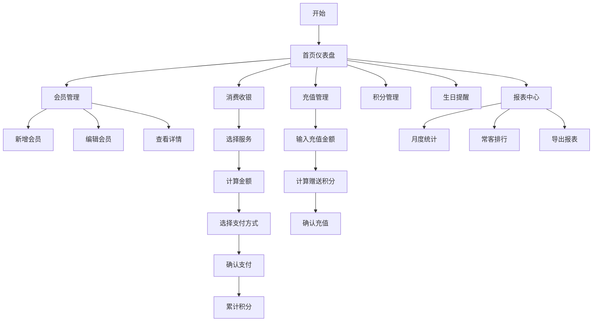

## 1. 产品概述

理发店会员积分管理系统，帮助店面管理者高效管理会员信息、储值金额和积分。支持充值送积分、消费扣减金额并累计积分、积分抵现/兑换、生日提醒及月度报表导出等核心功能。

- **目标用户**：理发店店主/前台收银人员
- **核心价值**：简化会员管理流程，提升客户粘性，数据化经营决策
- **使用场景**：日常收银、会员管理、营销活动、月度经营分析

## 2. 核心功能

### 2.1 用户角色
| 角色 | 注册方式 | 核心权限 |
|------|----------|----------|
| 店主/管理员 | 无需登录，打开即用 | 全部功能：会员管理、消费收银、积分调整、报表查看、系统设置 |

### 2.2 功能模块
1. **首页仪表盘**：今日营业概览、近期生日提醒、快捷操作入口
2. **会员管理**：会员列表、新增/编辑会员、搜索筛选、会员详情
3. **消费收银**：选择服务项目、计算金额、扣减储值/积分、累计积分
4. **充值管理**：会员储值充值、充值送积分规则
5. **积分管理**：手动调整积分、积分兑换记录
6. **生日提醒**：近期生日会员列表、生日优惠券发放
7. **报表中心**：月度经营报表、充值/消费/积分统计、常客排行、数据导出

### 2.3 页面详情
| 页面名称 | 模块名称 | 功能描述 |
|---------|----------|----------|
| 首页仪表盘 | 数据概览卡片 | 显示今日充值额、今日消费额、会员总数、积分总数 |
| 首页仪表盘 | 近期生日提醒 | 展示未来7天过生日的会员，支持一键发送祝福 |
| 首页仪表盘 | 快捷操作 | 快速新增会员、快速收银、快速充值入口 |
| 会员管理页 | 会员列表 | 表格展示所有会员，支持分页、排序、搜索 |
| 会员管理页 | 新增/编辑会员 | 表单录入姓名、电话、生日、初始金额、初始积分 |
| 会员管理页 | 会员详情 | 查看会员基本信息、消费记录、充值记录、积分变动记录 |
| 消费收银页 | 服务选择 | 选择洗发/剪发/烫染等服务项目，显示单价 |
| 消费收银页 | 结算方式 | 选择储值支付/积分抵现/混合支付，计算实付金额 |
| 消费收银页 | 积分累计 | 消费后按规则自动累计积分 |
| 充值管理页 | 充值表单 | 选择会员、输入充值金额、显示赠送积分 |
| 积分管理页 | 积分调整 | 手动增加/扣减积分，填写原因 |
| 生日提醒页 | 生日列表 | 按月份筛选过生日的会员 |
| 报表中心页 | 月度统计 | 本月充值总额、消费总额、积分消耗、新增会员数 |
| 报表中心页 | 常客排行 | 按消费次数/消费金额排序的会员榜单 |
| 报表中心页 | 数据导出 | 导出CSV格式报表文件 |

## 3. 核心流程

### 3.1 消费收银流程
1. 进入收银页面，搜索或选择会员
2. 选择服务项目（可多选）
3. 系统自动计算总金额
4. 选择支付方式（储值/积分抵现/组合）
5. 确认支付，扣减储值金额/积分
6. 按消费金额累计积分
7. 生成消费记录，返回成功提示

### 3.2 会员充值流程
1. 进入充值页面，选择会员
2. 输入充值金额
3. 系统根据充值规则计算赠送积分
4. 确认充值，储值余额增加
5. 积分到账，生成充值记录

### 3.3 报表生成流程
1. 进入报表中心，选择月份
2. 系统统计该月充值、消费、积分数据
3. 展示各类统计图表和榜单
4. 支持导出CSV格式报表

## 4. 用户界面设计

### 4.1 设计风格
- **主色调**：深蓝色系（#1e40af），传达专业、可信赖的感觉
- **辅助色**：暖金色（#f59e0b），用于强调和积分相关元素
- **背景色**：浅灰蓝渐变背景，营造干净清爽的氛围
- **按钮风格**：圆角矩形按钮，悬停时有轻微上浮和阴影效果
- **字体**：使用现代无衬线字体，清晰易读
- **布局风格**：左侧导航栏 + 右侧内容区，卡片式布局
- **图标风格**：线性图标，简洁统一

### 4.2 页面设计概览
| 页面名称 | 模块名称 | UI 元素 |
|---------|----------|---------|
| 首页仪表盘 | 数据概览 | 4张彩色统计卡片，带渐变背景和图标 |
| 首页仪表盘 | 生日提醒 | 头像列表 + 生日倒计时标签 |
| 会员管理页 | 会员列表 | 数据表格，带搜索框和筛选按钮 |
| 会员管理页 | 会员表单 | 弹窗表单，输入框带图标 |
| 消费收银页 | 服务选择 | 服务卡片网格，点击选中效果 |
| 消费收银页 | 结算面板 | 右侧固定结算栏，金额大字显示 |
| 报表中心页 | 统计图表 | 柱状图展示月度数据趋势 |
| 报表中心页 | 排行列表 | 前三名带奖牌图标 |

### 4.3 响应式
- **桌面端优先**：主要面向电脑使用，优化宽屏体验
- **平板适配**：在中等屏幕上自动调整布局
- **触控优化**：按钮和可点击区域足够大，支持触屏操作

### 4.4 动效设计
- 页面切换：淡入淡出过渡
- 卡片悬停：轻微上浮 + 阴影加深
- 按钮点击：缩放反馈
- 数据更新：数字滚动动画
- 弹窗出现：从下方滑入 + 淡入
