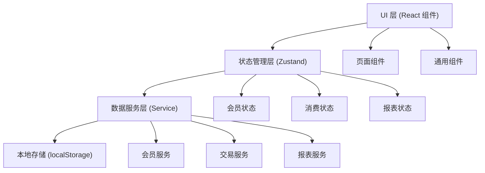
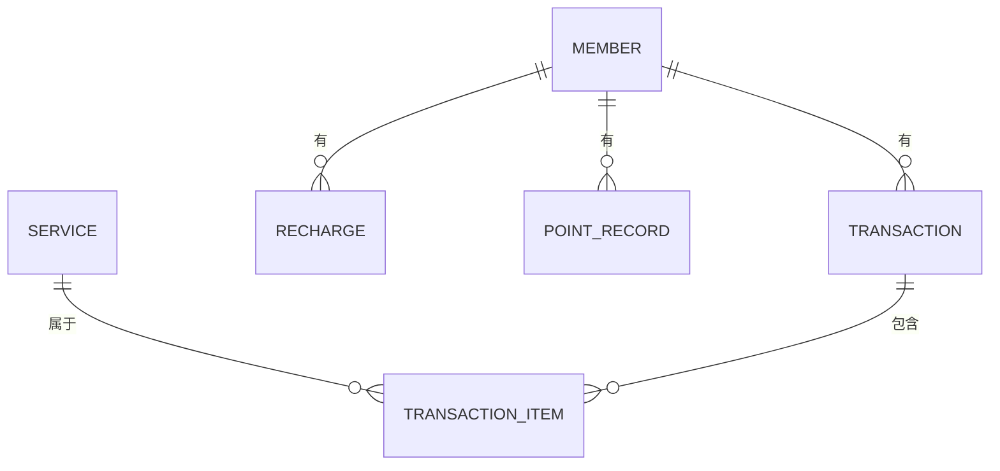

## 1. 架构设计

本系统为纯前端单页应用，数据存储在浏览器本地（localStorage），无需后端服务器。整体采用分层架构，确保代码清晰、可维护。



## 2. 技术说明

- **前端框架**：React@18 + TypeScript
- **构建工具**：Vite@5
- **样式方案**：Tailwind CSS@3
- **状态管理**：Zustand
- **路由管理**：React Router DOM@6
- **图标库**：Lucide React
- **数据存储**：浏览器 localStorage
- **图表展示**：原生 SVG / Recharts（可选）
- **数据导出**：CSV 格式，纯前端生成

## 3. 路由定义

| 路由路径 | 页面名称 | 功能说明 |
|---------|----------|----------|
| `/` | 首页仪表盘 | 数据概览、生日提醒、快捷操作 |
| `/members` | 会员管理 | 会员列表、新增、编辑、搜索 |
| `/members/:id` | 会员详情 | 会员信息、消费记录、充值记录 |
| `/checkout` | 消费收银 | 选择服务、结算、积分累计 |
| `/recharge` | 充值管理 | 会员储值充值、赠送积分 |
| `/points` | 积分管理 | 手动调整积分、积分记录 |
| `/birthday` | 生日提醒 | 生日会员列表、优惠券管理 |
| `/reports` | 报表中心 | 月度统计、常客排行、数据导出 |
| `/settings` | 系统设置 | 服务项目、积分规则、充值规则配置 |

## 4. 数据模型

### 4.1 数据实体关系



### 4.2 数据模型定义

#### 会员 (Member)
```typescript
interface Member {
  id: string;
  name: string;
  phone: string;
  birthday: string | null;
  balance: number;
  points: number;
  totalConsumption: number;
  totalRecharge: number;
  visitCount: number;
  createdAt: string;
  updatedAt: string;
  notes: string;
}
```

#### 服务项目 (Service)
```typescript
interface ServiceItem {
  id: string;
  name: string;
  price: number;
  category: 'shampoo' | 'haircut' | 'perm_dye' | 'other';
  pointsRate: number;
  isActive: boolean;
}
```

#### 消费记录 (Transaction)
```typescript
interface Transaction {
  id: string;
  memberId: string;
  totalAmount: number;
  balanceUsed: number;
  pointsUsed: number;
  pointsEarned: number;
  items: TransactionItem[];
  createdAt: string;
  notes: string;
}

interface TransactionItem {
  serviceId: string;
  serviceName: string;
  price: number;
  quantity: number;
}
```

#### 充值记录 (Recharge)
```typescript
interface Recharge {
  id: string;
  memberId: string;
  amount: number;
  bonusPoints: number;
  createdAt: string;
  notes: string;
}
```

#### 积分变动记录 (PointRecord)
```typescript
interface PointRecord {
  id: string;
  memberId: string;
  change: number;
  type: 'earn' | 'spend' | 'adjust' | 'birthday';
  reason: string;
  createdAt: string;
}
```

#### 系统配置 (Settings)
```typescript
interface Settings {
  pointsPerYuan: number;
  pointValue: number;
  birthdayBonusPoints: number;
  rechargeRules: RechargeRule[];
  services: ServiceItem[];
}

interface RechargeRule {
  amount: number;
  bonusPoints: number;
}
```

### 4.3 初始数据

系统首次运行时，自动初始化以下数据：

**默认服务项目：**
- 洗发：38元
- 剪发：68元
- 吹造型：48元
- 烫发：298元
- 染发：268元
- 烫染套餐：498元

**默认积分规则：**
- 消费1元积1分
- 100积分抵1元
- 生日赠送100积分

**默认充值规则：**
- 充200送200积分
- 充500送600积分
- 充1000送1500积分

## 5. 项目结构

```
src/
├── components/          # 通用组件
│   ├── Layout/         # 布局组件（侧边栏、顶部栏）
│   ├── MemberCard/     # 会员卡片
│   ├── StatCard/       # 统计卡片
│   ├── Modal/          # 弹窗组件
│   └── Table/          # 表格组件
├── pages/              # 页面组件
│   ├── Dashboard/      # 首页仪表盘
│   ├── Members/        # 会员管理
│   ├── MemberDetail/   # 会员详情
│   ├── Checkout/       # 消费收银
│   ├── Recharge/       # 充值管理
│   ├── Points/         # 积分管理
│   ├── Birthday/       # 生日提醒
│   ├── Reports/        # 报表中心
│   └── Settings/       # 系统设置
├── store/              # Zustand 状态管理
│   ├── useMemberStore.ts
│   ├── useTransactionStore.ts
│   └── useSettingsStore.ts
├── utils/              # 工具函数
│   ├── storage.ts      # 本地存储封装
│   ├── date.ts         # 日期处理
│   ├── export.ts       # 数据导出
│   └── id.ts           # ID 生成器
├── types/              # TypeScript 类型定义
│   └── index.ts
├── data/               # 初始数据
│   └── mockData.ts
├── App.tsx
├── main.tsx
└── index.css
```

## 6. 技术决策说明

### 6.1 为什么选择纯前端 + localStorage
- 单店单人使用，不需要多端数据同步
- 部署简单，打开网页即可使用
- 数据存在用户本地，隐私性好
- 开发成本低，迭代速度快

### 6.2 数据持久化策略
- 所有数据变更后立即同步到 localStorage
- 页面加载时从 localStorage 读取数据
- 提供数据导出/导入功能，方便备份

### 6.3 性能考虑
- 数据量小（单店会员一般几百到几千），前端计算无压力
- 使用 Zustand 管理状态，避免不必要的重渲染
- 列表数据使用虚拟滚动（如需要）

### 6.4 扩展性
- 预留后端 API 接口层，未来如需云端同步，只需替换 service 层
- 组件化设计，便于功能扩展
